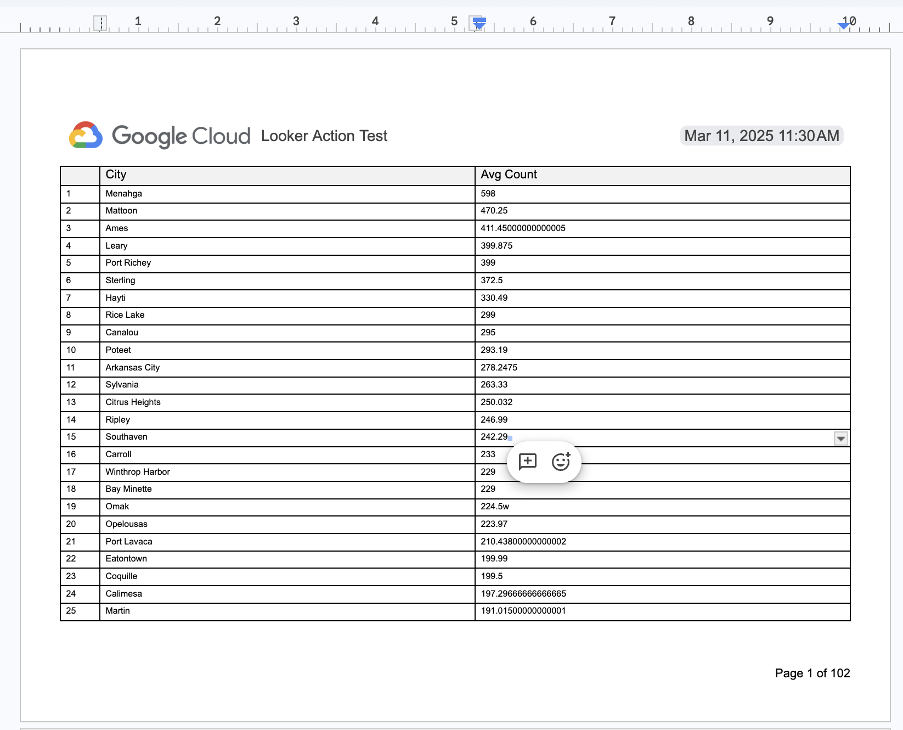

# Google Docs Action (from Hub)



A lightweight, fully minimized standalone Looker Action Hub hosting **only** the Google Docs Looker action (`google_docs`). The purpose of this is to get unlimited results into Google Docs which supports:

- Headers & Footers
- Page numbers and dynamic text
- Section breaks
- Table headers across all pages
- PDF and physical printing

Here is a link to an example [output document with unlimited results](https://docs.google.com/document/d/17Sk_EJdvKc1P8UI68z973-1zkn8Zm_W6sOfbGds4TCg/edit?usp=sharing) and a downloadable [PDF](https://docs.google.com/document/d/17Sk_EJdvKc1P8UI68z973-1zkn8Zm_W6sOfbGds4TCg/export?format=pdf).


## What It Does

When Looker sends a query payload to this action, it:
1. **Validates & Authenticates**: Verifies the user's OAuth tokens against Google Drive/Docs APIs and enforces any domain allowlists (`domain_allowlist`).
2. **Creates Document**: Initializes a new Google Doc (`application/vnd.google-apps.document`) in the requested Google Drive folder or Shared Drive.
3. **Applies Landscape Formatting**: Configures page layout to Landscape (`11" x 8.5"`) with `0.5"` margins.
4. **Streams & Batches CSV Data**: Streams the CSV export directly into a Google Doc table, sending Google Docs API batch updates (default 100 insertions/batch) to avoid request limits.
5. **Styles the Table**:
   - Bolds and pins the table header row across page breaks.
   - Shades the header row with a light-gray background.
   - Configures fixed column widths (first column at `0.5"`, remaining columns distributed evenly).
   - Formats table text at `8pt` font size.
6. **Handles Rate Limits**: Employs automatic exponential backoff retries (up to 5 times) on API rate limit (`429`) or server (`5xx`) responses.

---

## Connecting to Looker

Once your Cloud Run service is deployed, connect it to your Looker instance as a new standalone Action Hub:

1. In your Looker instance, navigate to **Admin** > **Platform** > **Actions**.
2. Scroll to the bottom and click **Add Action Hub**.
3. Enter the URL of your deployed Cloud Run service (e.g., `https://google-docs-action-xxx-uc.a.run.app`).
4. Enter the **Authorization Token** corresponding to your deployed service (configured via `ACTION_HUB_SECRET` or authorization headers).
5. Click **Add Hub**. The **Google Docs** action will now appear in your list of integrations ready to be enabled.

---

## Deploying to Google Cloud Run

You can easily launch this standalone action integration into Google Cloud Run:

```bash
gcloud run deploy google-docs-action \
  --image=<image-url> \
  --platform=managed \
  --region=us-central1 \
  --allow-unauthenticated \
  --set-env-vars="GOOGLE_DOC_CLIENT_ID=your_id,GOOGLE_DOC_CLIENT_SECRET=your_secret"
```

---

## Getting Started

### Prerequisites
- **Node.js**: `>= 20.16.0`
- **Yarn**: `>= 1.19.1`

### 1. Local Installation & Configuration
Install project dependencies via Yarn:
```bash
yarn install
```

Create a `.env` file from the example template to supply required OAuth and internal server variables:
```bash
cp .env.example .env
```
Ensure your `.env` contains your Google API credentials if executing live OAuth calls:
```env
GOOGLE_DOC_CLIENT_ID=your_google_client_id
GOOGLE_DOC_CLIENT_SECRET=your_google_client_secret
```

### 2. Starting the Local Server

To start the production server locally:
```bash
yarn start
```

To run the development server with hot-reloading:
```bash
yarn dev
```

---

## Running Tests

To run the complete test suite (Mocha unit & integration tests, TypeScript compilation, and TSLint):
```bash
yarn test
```
